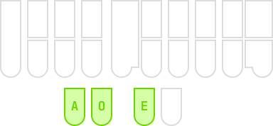

# What's Plumbers?
Plumbers is a **numbers** system for **[Plover](https://github.com/openstenoproject/plover)** (and the Plover steno theory), inspired by how the Phoenix theory handles writing numbers.

<!-- TOC -->

- [What can I do with it?](#what-can-i-do-with-it)
- [How do I use it?](#how-do-i-use-it)
    - [Installation](#installation)
    - [Usage](#usage)
        - [From 0 to 100 real quick](#From-0-to-100-real-quick)
        - [Hundreds, thousands, millions and billions](#hundreds-thousands-millions-and-billions)
        - [Complex numbers](#complex-numbers)
        - [Formatting](#formatting)
        - [Written-out numbers](#written-out-numbers)
- [Hacking and modifying](#hacking-and-modifying)

<!-- /TOC -->

## What can I do with it?
* Write numbers 0-99 **in a single stroke**.
* Write hundreds, thousands, millions and billions (e.g. 400, 2000, 8000000...) **in a single stroke**.
* Add them together and write big complex numbers **just like you would say them**. For example, the number 35424 can be written as 35 - Thousand - 400 - 24.
    * `STHRAOEUF/KWRAOPBD/STPR-DZ/STWOUR` -> 35424
* Write numbers **in full words** the same way, just by adding an asterisk anywhere while writing the number (you can usually also do that by hitting `*#`).
    * `STHRAO*EUF` -> Thirty-five
    * `STHRAOEUF/KWRAOPBD/STPR-DZ/STWO*UR` -> Thirty-five thousand, four hundred and twenty-four
* Format the numbers you're writing as you want them to be with an additional stroke.
    * `STHRAOEUF/KWRAOPBD/STPR-DZ/STWOUR/KPHA*` -> 35,424

## How do I use it?
### Installation

Plumbers is a python dictionary, meaning you need to make sure you have the [python_plover_dictionary](https://github.com/openstenoproject/plover_python_dictionary) plugin installed (you can also do that from the Plugins Manager directly in Plover).

Once that's done, you just need to download the Plumbers dictionary (`Plumbers.py`) from the releases section (to be added) or directly on the repo, and add it to your dictionaries in Plover.

### Usage

If you've ever used a phrasing system, Plumbers works exactly like those (but a simple one).

You have some starter chords, some ender chords, and you just need to connect them together to write the number you want.

#### From 0 to 100 real quick

Writing numbers below 100, starter chords correspond to tens and enders correspond to singles. Writing 27, you need to use the starter for 2 (`STW`) and the ender for 7 (`EFPB`). 

Numbers 0-19 are actually a bit different, since they're either written phonetically or with the starter chord and the "teen" ender chord, `-FPB` (see below).

Unfold below to find the lists of starter, ender, and unique (0-19) chords.

Starter chords

| Stroke                                                           | Number | Notes                                                                          |
| :------:                                                         | :---------: | -----                                                                          |
|    `STKHR` | 0           | Shape based                                                                    |
|    `WU`       | 1           | Like **WU**N. This one can use a vowel because it's only used with big enders. |
|    `STW`     | 2           | **Tw**o                                                                        |
|    `STHR`   | 3           | **Thr**ee                                                                      |
|    `STPR`   | 4           | **F**ou**r**                                                                   |
|    `STPHR` | 5           | Like four but one more key                                                     |
|    `SKH`     | 6           | **S**i**x**, kind of?                                                          |
|    `SKPH`   | 7           | Like six, but one more key                                                     |
|    `SKPR`   | 8           | Shaped based                                                                   |
|    `STWH`   | 9           | Shape based                                                                    |
|    `KWRAO` | linker      | Similar to the common linker `KWR`, but differentiated with `AO`               |

Ender chords

| Stroke                                   | Number | Notes |
| :------:                                 | :---------: | ----- |
|    `-T`        | 0          |-**t**y       |
|    `UPB`    | 1           |W**un**       |
|    `AO`     | 2           |Tw**o**       |
|    `AOE`    | 3           |Thr**ee**       |
|    `OUR`    | 4           |F**our**       |
|    `AOEUF`  | 5           |F**ive**       |
|    `EUBGS`  | 6           |S**ix**       |
|    `EFPB`   | 7           |S**even**       |
|    `AET`    | 8           |**Eight**       |
|    `AOEUPB` | 9           |N**ine**       |

Numbers 0-19

* `0` → `SRAO`
* `1` → `WAOPB` - "One" being a common word besides the number, we keep away from the usual `WUN`.
* `2` → `TWO`
* `3` → `THRAOE`
* `4` → `TPOUR`
* `5` → `TPAOEUF`
* `6` → `SEUBGS`
* `7` → `SEFPB`
* `8` → `AET`
* `9` → `TPHAOEUPB`
* `10` → `TEPB`
* `11` → `HREFPB`
* `11` → `WAOFPB`
* `12` → `TWEFL`
* `12` → `STWFPB` - Starting with 12, we can use starter chords and end with `-FPB`
* `13` → `STHRFPB`
* `14` → `STPRFPB`
* `15` → `STPHRFPB`
* `16` → `SKHFPB`
* `17` → `SKPHFPB`
* `18` → `SKPRFPB`
* `19` → `STWHFPB`

#### Hundreds, thousands, millions and billions

Writing multiple of hundreds, thousands, millions and billions is done in the same way as numbers 0-99, using the starter corresponding to the number of those you want, and one of the following  ender chords:

Big ender chords

| Stroke                                   | Translation | Notes |
| :------:                                 | :---------: | ----- |
|    `-DZ`       | 100         |Hundre**ds**       |
|    `-PBD`      | 1,000        |Thousa**nd**       |
|    `-FPL`      | 1,000,000     |**M**i**l**lion       |
|    `-BL`       | 1,000,000,000  |**B**i**l**lion     |

If the number you want to write is *over 9000*, though, you'll need to use the linker chord on the left side: `KWRAO`. Writing 27 millions will then be as easy as writing `27` (`STWEFPB`) and then `KWRAOFPL`. 

  

#### Complex numbers

Once you can write simple numbers, writing more complex ones in multiple strokes is just a matter of chaining them, just like you would when saying them out loud. Any combination that makes sense as a number should work (if it doesn't, let me know!).

As an example, writing 3256525, you would decompose it as: `3000000`/`200`/`56`/`-000`/`500`/`25`.

  

#### Formatting

If you've been reading everything so far, chances are you've been counting zeroes. Large numbers are difficult to read, which is why they are usually formatted with a separator (depending on where you live) every 3 digits from the right. 

Plumbers allows you to do this by using a stroke at any time while you're writing your number. What's more, it actually *toggles* that formatting, meaning you don't have to backtrack all the way if you change your mind after you're done. Just hit it again and you're all good.

Currently supported separators are:
* `KPHA*` → Commas
* `SP*` → Spaces
* `PR*` → Periods

But you can easily add your own.

##### Examples:

`STPHR-BL` → 5000000000  
`STPHR-BL/KPHA*` → 5,000,000,000  
`STPHR-BL/SP*` → 5 000 000 000

#### Written-out numbers

One of the coolest features of Plumbers is the ability to write numbers in their written-out form.

While you're writing your number, at any time, add an asterisk (`*`) to a stroke and you'll be turning it into words. Just like formatting, doing this actually toggles the feature, so if at any point you change your mind, add an asterisk to a stroke once more and it'll turn back into digits.

You might also already have a `"#*": "{*}"` entry in one of your dictionaries, which I highly recommend, since that will allow you to add or remove an asterisk to your latest stroke. This makes it easier to toggle the written-out form without hitting an awkward stroke.

##### Examples:
`TPOUR` -> 4  
`TPO*UR` -> Four  
`SKPHAOEUF` -> 75  
`SKPHAOEUF/#*` -> Seventy-five  
`STPHR-BL/STW-DZ/SKHEFPB/KWRAOFPL/SKPR-DZ/STWHEUBGS/KWRAOPBD/WUDZ/STHRAET` -> 5267896138  
`STPHR*BL/STW-DZ/SKHEFPB/KWRAOFPL/SKPR-DZ/STWHEUBGS/KWRAOPBD/WUDZ/STHRAET` -> Five billion, two hundred and sixty-seven million, eight hundred and ninety-six thousand, one hundred and thirty-eight

Note that American and British English don't use the same exact forms. Americans tend not to say "and" before single or double-digits numbers ("One hundred thirty"), while British English speakers do ("One hundred **and** thirty").  
To that effect, there is a variable in the dictionary that you can change to get your preferred form.

## Hacking and modifying

As much as possible, I've tried to make Plumbers as easy to modify as possible, without even understanding how the code works.

At the top of the dictionary, you'll find python dictionaries listing all of the chords used by Plumbers next to their corresponding number, as well as a couple options mentioned earlier.

While I did try to come up with starters that didn't conflict with anything (either in Plover theory or in common dictionaries like Emily's Symbols or Aerick's Phrasing, which I was using when I started working on Plumbers), I can't guarantee you won't have any conflicts with what you're using. Unfortunately, as it stands, I believe Plumbers is sharing a couple starter chords with Jeff's Phrasing dictionary.

**I do encourage you to change anything you don't like though!** Steno dictionaries are inherently personal, and If you find better enders, starters that make more sense to you, or ways to make Plumbers not clash with anything you're using, that's great. In fact I'd love it if you could let me know about what you're doing, it could help me make Plumbers better in the future. I'm always around on the Plover discord (`Vermoot#3239`), or here on Github.
